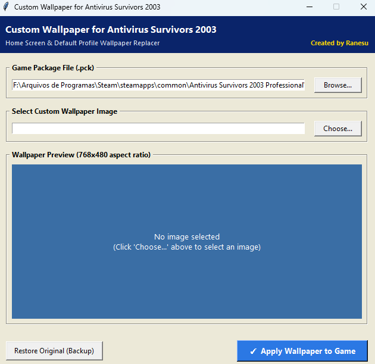
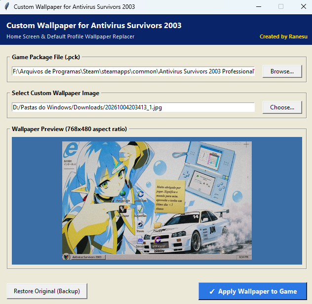

# Custom Wallpaper for Antivirus Survivors 2003

A lightweight, dedicated modding tool to customize the desktop and home screen wallpaper for the Steam game **"Antivirus Survivors 2003 Professional"**.

Created by **Ranesu**.

---

## 📸 Screenshots

| Tool Interface | Custom Image Selected & Preview |
| :---: | :---: |
|  |  |

---

## 🌟 Features

- **One-Click Wallpaper Injection:** Replaces the default desktop wallpaper (`treebliss`) directly inside the game package (`AVS03Pro.pck`).
- **Universal Image Support:** Automatically imports `.png`, `.jpg`, `.jpeg`, `.bmp`, and `.webp` images.
- **Godot 4 Native Optimization:** Converts your custom picture into an authentic Godot 4 `CompressedTexture2D` (`GST2`) with **WebP lossless compression** and a complete **10-level mipmap chain** at `768x480` resolution. Ensures crisp rendering on the in-game virtual CRT screen with zero performance penalty.
- **Automatic Safe Backup:** Automatically creates a pristine backup (`AVS03Pro.pck.bak`) of your game file before making any changes.
- **One-Click Restore:** Includes a button to revert to the original unmodded game at any time.
- **Retro Windows UI:** Styled with a nostalgic Windows XP / 2003 theme matching the game's retro aesthetic.

---

## 📥 Installation & Download

### Option 1: Standalone Portable Executable (Recommended)
1. Download `CustomWallpaper_AntivirusSurvivors2003_v1.0.zip` from the latest [GitHub Releases](https://github.com/rafael-lannes/Custom-Wallpaper-for-Antivirus-survivors-2003/releases).
2. Extract the archive anywhere on your PC.
3. Run `CustomWallpaper.exe`. No Python or extra installations required!

### Option 2: Running from Python Source
1. Ensure you have Python 3.10+ installed.
2. Install the Pillow dependency:
   ```bash
   pip install pillow
   ```
3. Run the tool:
   ```bash
   python custom_wallpaper_tool.py
   ```
   *(Or double-click `Run_Custom_Wallpaper_Tool.bat`)*

---

## 🎮 How to Use

1. **Check Game Path:**
   - The tool automatically detects the default Steam installation directory:
     `F:\Arquivos de Programas\Steam\steamapps\common\Antivirus Survivors 2003 Professional\AVS03Pro.pck`
   - If your game is installed in another Steam library or folder, click **"Browse..."** and select your `AVS03Pro.pck` file.
2. **Choose Your Wallpaper:**
   - Click **"Choose..."** and select any image from your computer.
   - Review how your image looks in the live preview window (scaled to the native 768x480 aspect ratio).
3. **Apply:**
   - Click **"✓ Apply Wallpaper to Game"**.
   - A success popup will confirm when the texture has been written.
4. **Launch Game:**
   - Open **Antivirus Survivors 2003 Professional** on Steam. Your custom wallpaper will be displayed on the desktop screen right away!

---

## 🔄 How to Restore the Original Game

If you ever want to return to the original wallpaper:
1. Open the tool.
2. Click **"Restore Original (Backup)"**.
3. Confirm the dialog to restore the pristine game file.

---

## 🛠️ Credits & License

- **Developer:** Ranesu ([rafael-lannes](https://github.com/rafael-lannes))
- **Target Game:** [Antivirus Survivors 2003 Professional on Steam](https://store.steampowered.com/)
- **License:** MIT License
